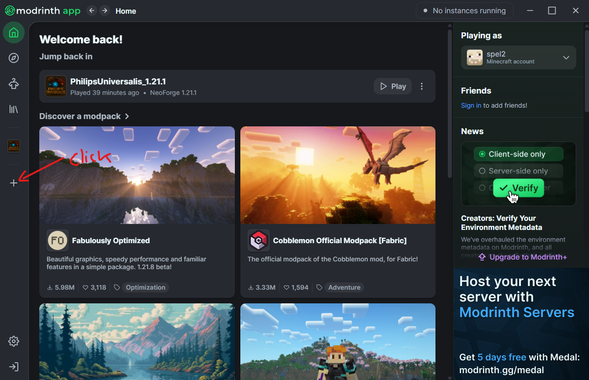
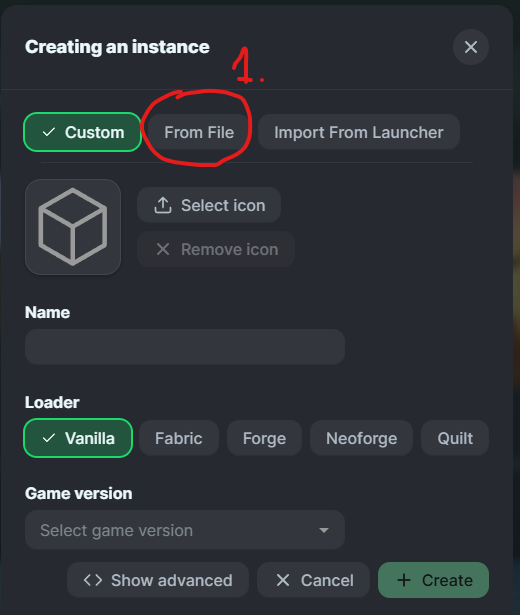
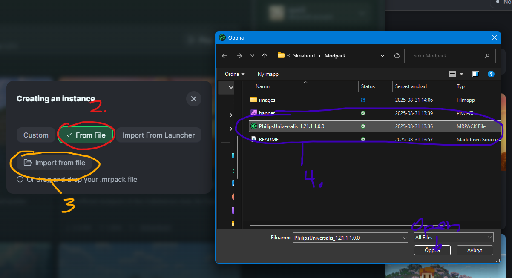

# Philip's Universalis modpack!
This is a modpack for the minecraft server (1.21.1) Philip's Universalis!

## Installation instructions.
1. [Install modrinth, click on this link to visit their download link.](https://modrinth.com/app) Open up the app when done!
2. Sign in to your Minecraft account.
3. Add modpack instance:   
4. Click Play!

## Server information.
IP address: 213.66.115.111:25565

## Oh...
Ask Philip for whishlist access! (For security reasons).

## Rules
1. Invite people only YOU know.
2. Be nice!
3. Racism/Sexual harrasment = BAN.